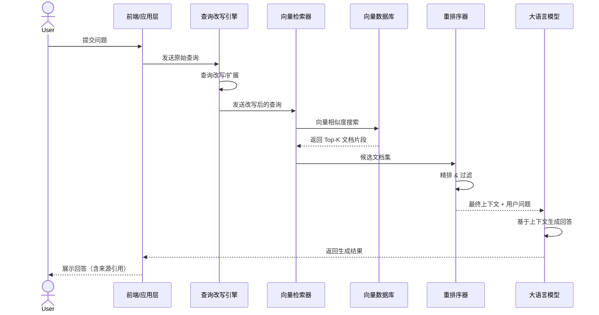
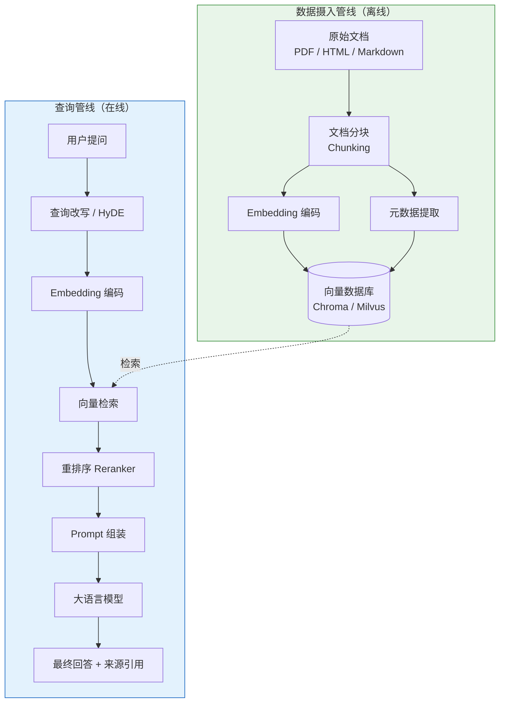
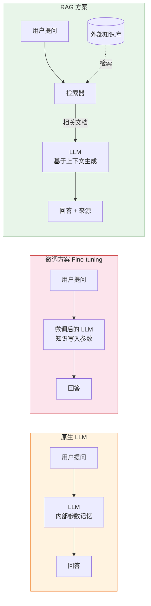

## 什么是 RAG

RAG（Retrieval-Augmented Generation，检索增强生成）是一种结合了**检索（Retrieval）** 和 **生成（Generation）** 的大语言模型（LLM）应用架构。它通过将外部知识库与 LLM 相结合，使模型能够在不重新训练的情况下访问最新、最准确的信息。

简单来说，RAG 的核心工作流程分为三步：

1. **检索阶段**：从外部知识库（文档、数据库、网页等）中检索与用户问题相关的片段
2. **增强阶段**：将检索到的上下文信息与用户的问题拼接在一起
3. **生成阶段**：LLM 基于增强后的上下文生成回答

RAG 最早由 Meta AI 研究团队在 2020 年提出（[Lewis et al., 2020](https://arxiv.org/abs/2005.11401)），旨在让 LLM 能够访问最新的、特定领域的知识，而不必完全依赖模型内部的参数化记忆。

### RAG 工作流程序列图

下面的序列图展示了 RAG 系统中各组件之间的交互时序：



<!--more-->

## 为什么要用 RAG

### 解决 LLM 的核心痛点

| 问题 | 说明 |
|------|------|
| **知识截止日期** | LLM 的训练数据有时间限制，无法获知最新的信息 |
| **幻觉问题** | LLM 有时会生成看似合理但实际上是错误的内容 |
| **领域知识缺失** | LLM 缺乏企业内部、特定行业或私有数据的知识 |
| **不可追溯** | LLM 无法告诉用户它从哪里获取了信息 |

### RAG 的核心优势

**1. 减少幻觉，提升准确性**

LLM 在回答时有了明确的参考资料作为支撑，大幅降低了"胡编乱造"的概率。回答可以溯源到具体的文档片段，用户可以验证每一条信息的来源。

**2. 知识实时更新**

无需重新训练模型，只需更新外部知识库，即可让 LLM 获取最新信息。这对于新闻、政策、产品更新等时效性强的场景尤为重要。

**3. 保护数据隐私**

企业敏感数据无需发送给 LLM 服务商或写入模型参数，只需在本地知识库中检索即可，数据始终在企业可控范围内。

**4. 低成本高效率**

相比微调（Fine-tuning）模型，RAG 不需要 GPU 训练资源，不需要准备大量标注数据，部署和维护成本更低。

**5. 灵活可扩展**

知识库可以随时增删改，支持多种数据源（文档、数据库、API 等），且可以跨多个 LLM 复用。

## RAG 系统的基本架构

一个典型的 RAG 系统由数据摄入和查询两条主线组成。下图展示了完整的系统架构：



## 如何提高 RAG 的效果

### 1. 优化文档处理（Document Processing）

#### 分块策略（Chunking）

文档分块是 RAG 效果的基石。不合理的分块会导致检索到的片段要么太碎（丢失上下文），要么太长（引入噪声）。

| 分块策略 | 优点 | 缺点 | 适用场景 |
|----------|------|------|----------|
| 固定大小分块 | 实现简单，速度快 | 可能切断语义 | 快速原型 |
| 语义分块 | 保持语义完整性 | 实现复杂度高 | 长文档、报告 |
| 递归分块 | 层次清晰，灵活性好 | 需要调参 | 结构化文档 |
| 滑动窗口分块 | 保留跨块上下文 | 存储冗余 | 对连贯性要求高的场景 |

推荐实践：一般建议块大小在 256-1024 tokens 之间，重叠率 10%-20%。

#### 元数据增强

为每个文档块添加元数据（标题、来源、日期、类别等），有助于后续检索和过滤：

```json
{
  "content": "RAG 通过检索外部知识库来增强 LLM 的回答...",
  "metadata": {
    "source": "rag-guide.pdf",
    "chapter": "第一章",
    "date": "2024-01-15",
    "category": "AI"
  }
}
```

### 2. 优化 Embedding 模型

Embedding 质量直接决定检索效果：

- **选择合适的模型**：根据语言和领域选择 Embedding 模型，如 `text-embedding-3-small`、`bge-large-zh`、`bce-embedding-base_v1` 等
- **领域微调**：在特定领域数据上微调 Embedding 模型，提升领域术语的表征能力
- **混合精度**：结合稠密向量（语义相似）和稀疏向量（关键词匹配）进行检索

### 3. 优化检索策略

#### 混合检索（Hybrid Search）

同时使用语义检索和关键词检索，取长补短：

```python
from langchain.retrievers import EnsembleRetriever
from langchain_community.retrievers import BM25Retriever
from langchain_chroma import Chroma
from langchain_openai import OpenAIEmbeddings

# 初始化向量检索器（语义检索）
vectorstore = Chroma(persist_directory="./chroma_db", embedding_function=OpenAIEmbeddings())
vector_retriever = vectorstore.as_retriever(search_kwargs={"k": 20})

# 初始化 BM25 检索器（关键词检索）
bm25_retriever = BM25Retriever.from_documents(documents)
bm25_retriever.k = 20

# 混合检索：语义权重 0.6 + 关键词权重 0.4
ensemble_retriever = EnsembleRetriever(
    retrievers=[vector_retriever, bm25_retriever],
    weights=[0.6, 0.4],
)

results = ensemble_retriever.invoke("什么是 RAG 的检索阶段？")
```

#### 查询改写（Query Rewriting）

用户原始问题可能表述不清或过于笼统，通过 LLM 改写可以提升检索效果：

- **多角度生成**：一个问题生成多个变体查询
- **HyDE（Hypothetical Document Embeddings）**：让 LLM 先生成一个假想答案，用假想答案的向量去检索

以下是使用 LangChain 实现基础 RAG 的最小可运行代码：

```python
from langchain_openai import ChatOpenAI, OpenAIEmbeddings
from langchain_chroma import Chroma
from langchain.text_splitter import RecursiveCharacterTextSplitter
from langchain_community.document_loaders import PyPDFLoader
from langchain.chains import RetrievalQA

# 1. 加载文档并分块
loader = PyPDFLoader("knowledge_base.pdf")
docs = loader.load()
splitter = RecursiveCharacterTextSplitter(chunk_size=512, chunk_overlap=64)
chunks = splitter.split_documents(docs)

# 2. 构建向量数据库
embeddings = OpenAIEmbeddings(model="text-embedding-3-small")
vectorstore = Chroma.from_documents(chunks, embeddings, persist_directory="./chroma_db")

# 3. 构建 RAG 链
llm = ChatOpenAI(model="gpt-4o", temperature=0)
qa_chain = RetrievalQA.from_chain_type(
    llm=llm,
    chain_type="stuff",
    retriever=vectorstore.as_retriever(search_kwargs={"k": 5}),
    return_source_documents=True,
)

# 4. 提问
result = qa_chain.invoke({"query": "RAG 是什么？它解决了哪些问题？"})
print(result["result"])
for doc in result["source_documents"]:
    print(f"\n--- 来源: {doc.metadata['source']}, 页码: {doc.metadata.get('page', 'N/A')} ---")
    print(doc.page_content[:200])
```

#### HyDE（假设文档嵌入）实现

HyDE 的核心思想是：先让 LLM 生成一个"假想答案"，再用该答案的向量去检索，因为假想答案与真实文档在语义空间上往往更接近。

```python
from langchain_openai import ChatOpenAI, OpenAIEmbeddings
from langchain_chroma import Chroma

llm = ChatOpenAI(model="gpt-4o", temperature=0.7)
embeddings = OpenAIEmbeddings(model="text-embedding-3-small")
vectorstore = Chroma(persist_directory="./chroma_db", embedding_function=embeddings)


def hyde_retrieval(query: str, k: int = 5) -> list:
    """使用 HyDE 策略检索相关文档。"""
    # Step 1: 让 LLM 生成一个假想答案
    hypothetical_prompt = (
        f"请写一段简短的回答来回答以下问题，"
        f"就好像你是在撰写一篇参考文档一样：\n\n问题：{query}"
    )
    hypothetical_answer = llm.invoke(hypothetical_prompt).content
    print(f"[HyDE] 假想答案:\n{hypothetical_answer}\n")

    # Step 2: 用假想答案的向量去检索真实文档
    results = vectorstore.similarity_search(hypothetical_answer, k=k)
    return results


# 使用示例
docs = hyde_retrieval("RAG 如何减少大模型幻觉？")
for i, doc in enumerate(docs):
    print(f"[结果 {i+1}] {doc.page_content[:150]}...\n")
```

#### 重排序（Reranking）

检索返回初步结果后，用专门的 Reranker 模型（如 Cohere Rerank、BGE-Reranker）对结果进行精排，保留最相关的片段。重排序是提升 RAG 精度最显著的手段之一。

### 4. 带元数据过滤的向量检索

在实际应用中，我们经常需要按日期、来源、类别等条件筛选文档。以 Chroma 为例：

```python
from langchain_chroma import Chroma
from langchain_openai import OpenAIEmbeddings

embeddings = OpenAIEmbeddings(model="text-embedding-3-small")
vectorstore = Chroma(persist_directory="./chroma_db", embedding_function=embeddings)

# 场景 1：按来源过滤 - 只从特定文档中检索
results = vectorstore.similarity_search(
    query="RAG 的优化策略",
    k=5,
    filter={"source": "rag-whitepaper.pdf"},
)

# 场景 2：按日期范围过滤 - 只检索 2024 年之后的文档
results = vectorstore.similarity_search(
    query="最新的 RAG 技术进展",
    k=5,
    filter={"date": {"$gte": "2024-01-01"}},
)

# 场景 3：组合过滤 - 来源 + 类别
results = vectorstore.similarity_search(
    query="大语言模型应用",
    k=5,
    filter={
        "$and": [
            {"source": {"$in": ["paper1.pdf", "paper2.pdf"]}},
            {"category": "AI"},
        ]
    },
)

for doc in results:
    print(f"[{doc.metadata.get('source')}] {doc.page_content[:100]}...")
```

### 5. 优化 Prompt 设计

检索到的上下文需要合理组织到 Prompt 中。以下是经过验证的 RAG Prompt 模板：

```text
你是一个专业的技术助手。请严格根据以下参考资料回答用户的问题。

## 参考资料
{retrieved_context}

## 用户问题
{user_query}

要求：
1. 仅基于上述参考资料回答，不要使用你自己的知识
2. 如果参考资料中没有相关信息，请明确告知"根据现有资料无法回答"
3. 回答时标注引用来源，格式如 [来源: 文件名]
4. 保持回答简洁、准确、专业
```

关键原则：**明确告诉模型只基于给定资料回答，减少幻觉**。在 Prompt 中加入"如果不知道就说不知道"的指令，可以显著降低幻觉率。

### 6. 引入反馈与评估机制

**自动评估指标**

| 指标 | 含义 | 优化方向 |
|------|------|----------|
| **Context Precision** | 检索到的文档中有多少是相关的 | 优化检索排名 |
| **Context Recall** | 相关文档有多少被检索到了 | 扩大检索范围、优化分块 |
| **Faithfulness** | 生成的回答是否忠实于检索到的内容 | 优化 Prompt 约束 |
| **Answer Relevancy** | 回答是否真正回应了用户的问题 | 优化查询改写 |

可以使用 [RAGAS](https://github.com/explodinggradients/ragas) 框架对以上指标进行自动化评估。

**用户反馈闭环**

收集用户对回答的评分和反馈，持续优化检索和生成策略。通过日志记录用户的点击、追问、修正等行为，形成数据飞轮。

### 7. 使用知识图谱增强（GraphRAG）

将文档中的实体和关系抽取为知识图谱（Knowledge Graph），可以：

- 提供更精确的结构化检索
- 支持多跳推理（从一个实体跳转到关联实体）
- 结合向量检索和图检索，形成 GraphRAG

微软开源的 [GraphRAG](https://github.com/microsoft/graphrag) 框架为这一方向提供了成熟的工具链。

## RAG vs 传统方案：架构对比

下图对比了三种主流 LLM 应用架构的差异：



| 维度 | 原生 LLM | 微调（Fine-tuning） | RAG |
|------|---------|-------------------|-----|
| 知识范围 | 仅训练数据 | 内化到参数中 | 外部知识库，灵活扩展 |
| 知识更新 | 需要重新训练 | 需要重新训练 | 实时更新，无需重训 |
| 部署成本 | 低 | 高（需要 GPU 训练） | 低（无需训练） |
| 数据需求 | — | 大量标注数据 | 少量数据构建知识库 |
| 可解释性 | 黑盒 | 黑盒 | 可追溯来源 |
| 适用场景 | 通用对话 | 特定风格/格式/任务 | 知识密集型问答 |

RAG、微调和原生 LLM 并非互斥，三者可以组合使用：用微调调整模型的风格和格式，用 RAG 提供最新的知识，用原生 LLM 处理不需要外部知识的通用推理任务。

## 总结

RAG 是当前构建 LLM 应用最实用、最具性价比的技术方案。通过不断优化文档处理、检索策略、排序机制和 Prompt 设计，可以显著提升 RAG 系统的效果。随着技术的演进，GraphRAG、Agentic RAG 等新范式也在不断涌现，RAG 的能力边界将持续扩展。

**实践建议**：从最基础的 RAG 架构开始，用 RAGAS 等工具量化当前效果，然后针对薄弱环节逐项优化。不要一开始就追求复杂的架构——简单方案往往已经能解决 80% 的问题。
